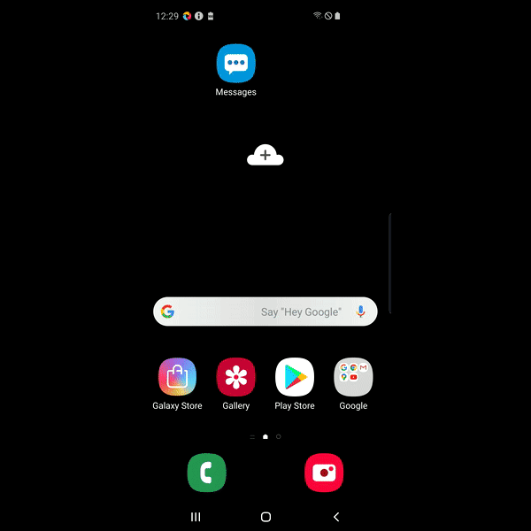
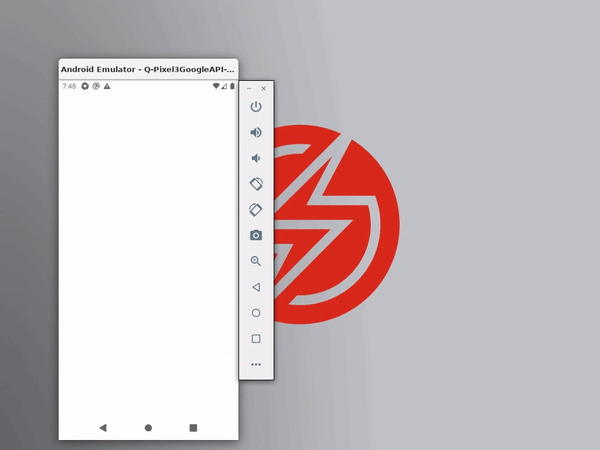

# Using Uploading and Downloading Files from Sauce Labs Emulators and Real Devices
This folder contains examples for using up / download files from:

- [Android real devices on the Sauce Labs RDC Cloud](#android-real-devices-on-the-sauce-labs-rdc-cloud)
- [Android Emulators on the Sauce Labs Emulator cloud](#run-tests-on-sauce-labs-android-emulators)
- [Android Emulator on your local machine](#run-tests-on-your-local-android-emulator)

> **NOTE:**\
> Up/downloading files to iOS real devices is not supported by Appium!\
> Up/downloading files to Sauce Labs iOS Simulators is currently not supported by Sauce Labs

## Install dependencies
You can install all dependencies by running the following command

    npm install

This will install all needed dependencies that are listed in the `package.json`-file

> **NOTE:**\
> Make sure you are in the folder `webdriverio/appium-app/examples/up-download-file` when you execute this command

## Important information
### Up/downloading files to and or from Android real devices
The market of Android is being controlled by a lot of different vendors, this also means a lot of different file structures 
where to upload your file to or download the file from. This makes it a challenge to determine which folder on the device you 
need to have.
You can check the location if you are using the Virtual USB offering of Sauce Labs for Private devices, 
see also [this video](https://youtu.be/hUaVj6WmqRA).

The advice is that you use a dedicated device, so you always know the file structure and don't need to over complicate 
the up/downloading script.

### Apps to verify up/downloads
For Android real devices we use the Samsung Gallery, and for Android emulators we use the Google Photos app. The purpose 
is not to show you how to automate these apps, but more to show you how you can verify if an upload was successful.  

### Environment variables for Sauce Labs
The examples in this repository that can run on Sauce Labs use environment variables, make sure you've added the following

    # For Sauce Labs Real devices in the New UI
    export SAUCE_USERNAME=********
    export SAUCE_ACCESS_KEY=*******

## Uploading files
### Android Real devices
The script on how to use this can be found [here](test/specs/real-devices/upload.image.android.real.spec.js) and the execution 
will look like this

### Android emulators
The script on how to use this can be found [here](test/specs/emu-sim/upload.image.android.emulator.spec.js) and the execution 
will look like this

## Android real devices on the Sauce Labs RDC Cloud
If you want to run the tests on Sauce Labs real devices then you can run the Android test with

    // If using the US DC
    npm run test.sauce.rdc.android.us
    
    // If using the EU DC
    npm run test.sauce.rdc.android.eu
    
The tests will be executed on a Samsung Galaxy 10.

See this [config](test/configs/wdio.android.sauce.real.conf.js)-file for more information.

## Run tests on Sauce Labs Android Emulators
If you want to run the tests on Sauce Labs Android Emulators then you can run the Android test with

    // If using the US DC
    npm run test.sauce.android.emulator.us
    
    // If using the EU DC
    npm run test.sauce.android.emulator.eu
    
The tests will be executed on an Android 8.1, 9.0 and 10.0.

See this [config](test/configs/wdio.android.sauce.emu.conf.js)-file for more information.

## Run tests on your local Android Emulator
If you want to run the tests on your local Android Emulator you can test this with

    // If using the US DC
    npm run test.local.android.emulator

Please check this [config](test/configs/wdio.android.local.emu.conf.js)-file for more information.

## Credits
This repo of examples is based on [this article](https://appiumpro.com/editions/2-seeding-an-android-device-with-test-photos)
from Jonathan Lipps.
